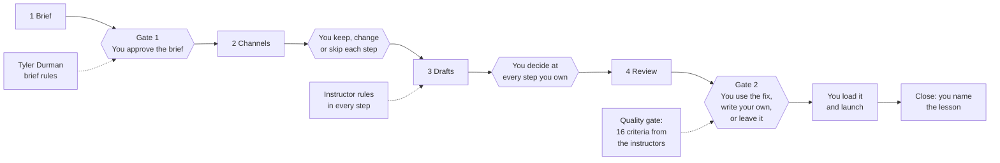

# Where you decide, and where the instructors' rules check the work

Claude does the drafting. Two things stop it from shipping anything on its own: **checks where you decide**, and **rules from CXL instructors that act as gates**. This page shows where each one sits.

## Where you decide

| Step | You decide | What Claude never does |
|---|---|---|
| Brief | Approve, change, or not yet (Gate 1) | Approve its own brief |
| Channels | Which channels; keep, change or skip each step; save as your default | Add or drop a check you didn't ask for |
| Drafts | Every step marked "You" in a workflow: 26 of 101 steps across the seven starters | Carry on past a step you own |
| Review | Use the fix, write your own, or leave it as is (Gate 2) | Ship a draft, or send anything |
| Launch | Load the drafts into your tools, run the test, go live | Write to your email, ad or CRM tool |
| Close | The result and the one lesson for next time | Estimate a result it can't source |

**The steps you own, per channel**

| Channel | Your steps |
|---|---|
| Email campaign | 2 of 14: the list is permissioned; the legal footer |
| Email sequence | 4 of 14: one record in the CRM; ready before the form goes live; timed with sales; approve the ask |
| Blog post | 4 of 13: search or social; bring in experts; add what AI can't; a named author |
| Social | 3 of 13: who posts; who's tagged; approve and schedule |
| Sales enablement | 7 of 16: the agreement with sales; the pilot sellers; the sales briefing; the sales lead approves; reps call within a day, prep meetings, follow up |
| Landing page | 3 of 16: walk it from the ad; speed and tracking; sign-off |
| Ad tests | 3 of 15: is LinkedIn worth it; what this test changes; launch |

## Where the instructors' rules act as gates

Every step in a workflow carries a rule and the instructor it comes from. The rules that matter most are also rows in the quality gate, so a draft that breaks them is flagged at Gate 2.

| Instructor | Course | Rules they gate | Where |
|---|---|---|---|
| Tyler Durman | Campaign briefs and plans, 2020 to 2025 | One KPI with a number and a date; the ask in every email; MQLs called within one business day; small-c or big-C | Gate 1; email sequence; sales enablement |
| Jessica Best | Email Marketing Fundamentals | Offer in the first 25 characters of the subject; one idea and one button per email; permission; deliverability limits | Email campaign; email sequence; Gate 2 rows Offer up front, One idea, Skimmable |
| Andy Crestodina | Content Strategy for Demand Generation | Original data or an opinion you can disagree with; the 3 Ps sign-up offer; link to the money page | Blog post; social |
| Tycho Luijten | B2B Demand Generation | A named expert posts, not only the company page; core topics with a point of view | Blog post; social; Gate 2 row Distribution |
| Michael Aagaard | Landing Page Optimization | Clear beats clever; answer their questions on the page; the button says what they get | Landing page |
| AJ Wilcox | Validate and Scale your LinkedIn Ads | Fix LinkedIn's defaults; test one thing at a time; 3,000 impressions before judging | Ad tests |
| Steve Armenti | Create sales enablement assets with AI | Approved claims only; a mismatched case study is worse than none; flags the rep clears; a human sends | Sales enablement |
| Mason Cosby | ABM: Get ROI in 6 Weeks; Align sales and marketing | A written agreement with sales; assets matched to the account's stage | Sales enablement; Gate 2 row Stage |
| Louis Grenier | Unique Positioning | A difference tied to a struggle the alternatives ignore | Gate 1; Gate 2 row Differentiation |

A decision model (Jev or Clef), if you turned one on, adds a second automatic check at both gates. It never decides; you do.
